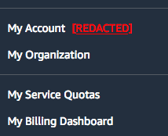
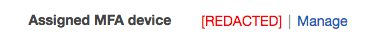
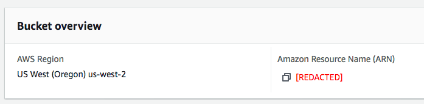
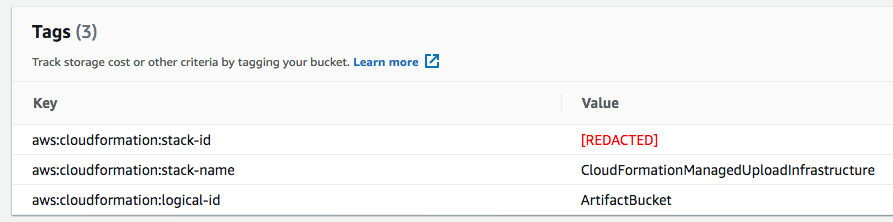
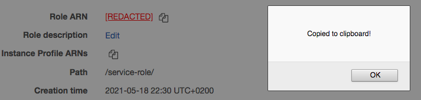

# AWS Console Redactor

Greasemonkey script that redacts sensitive information on your AWS Console.

## How it works

This script works by watching text nodes in your AWS Console DOM and replacing
those with sensitive data by a link with `[REDACTED]` text.

When clicked, this link will copy the sensitive data to your clipboard.

Sensitive data is defined by looking for specific patterns (or substrings) in these text nodes (today, these patterns are hardcoded in the user script).

---

## ** ATTENTION **

**Use this script at your own risk.**

Due to Greasemonkey characteristics, sensitive data is still visible for a short time while the page loads.

If you're recording your screen, someone checking the video frame by
frame can still spot sensitive data.

**The author isn't responsible by the consequences of using this script**
